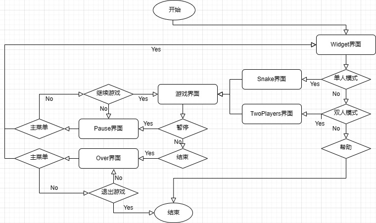
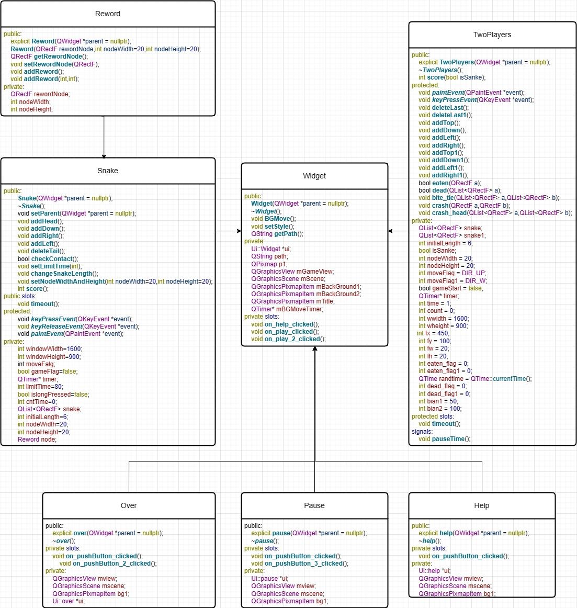

# 贪吃蛇C++程序设计课设

## 一 程序介绍🚩

### 1.1课程 

2023年C++程序设计课程作业

### 1.2 编程环境

- Qt 5.14.2
- MinGW73_64

### 1.3 运行与下载

#### 1.3.1运行

运行`.release`文件夹的`snake.exe`

#### 1.3.2下载

源码位置`.GameSnake`文件夹，使用集成QT的IDE编辑运行即可

## 二 游戏介绍🎉

### 2.1 操作

方向键“上”，“下”，“左”，“右”

| 按键  | 操作                   |
| ----- | ---------------------- |
| W(8)  | 向上移动               |
| S(2)  | 向下移动               |
| A(4)  | 向左移动               |
| D(6)  | 向右移动               |
| J     | 长按加速（仅单人模式） |
| ESC键 | 开始/暂停游戏          |

> 默认初始方向为向上移动，括号为双人模式玩家二的操作按钮

> 初始状态为暂停状态，按下ESC键开始游戏

### 2.2 主要功能

#### 2.2.1 主要函数

##### 2.2.1.1 蛇

`void addHead();`

`void addDown();`

`void addRight();`

`void addLeft();`

`void deleteTail();`

##### 2.2.1.2 奖品

`void addReword();`

##### 2.2.1.3 碰撞检测

`void checkContact();`

##### 2.2.1.4 速度设置

`void setLimitTime(int limitTime);`

#### 2.2.2 槽函数

##### 2.2.2.1 定时器启动

`void timeout();`

> 链接信号`Qtimer::timeout`

### 2.3 项目结构

#### 2.3.1 流程图

#### 2.3.2 项目关系

## 三 合作小伙伴👨‍🤝‍🧑

### 3.1刘杯鹤飞[**主页**](https://github.com/liubeihefei) 

### 3.2 🐏蝶
